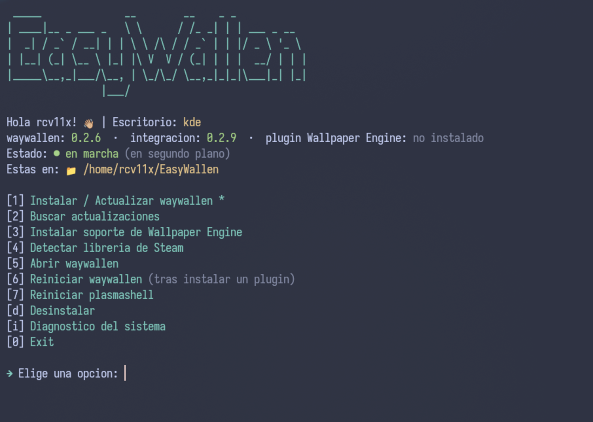
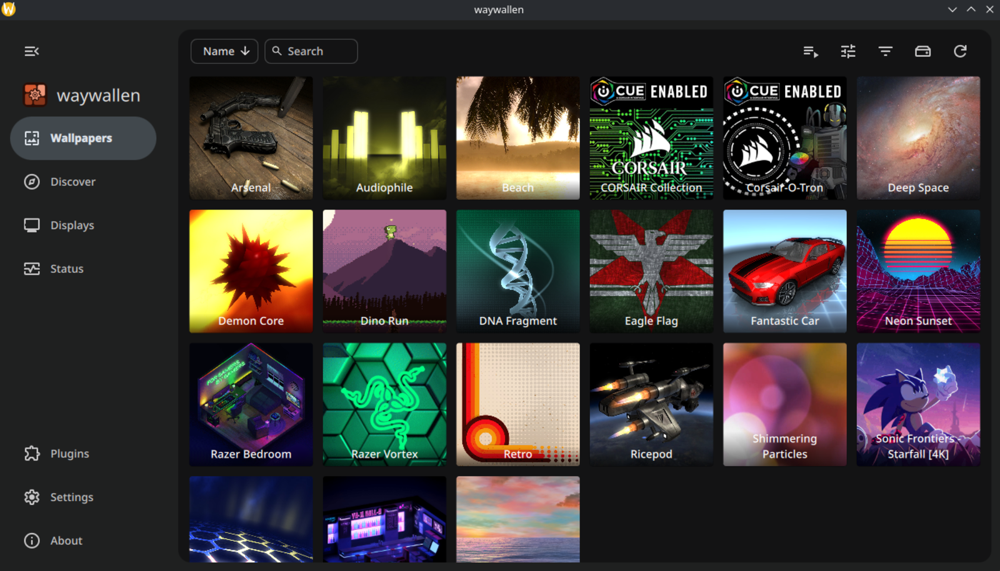

# EasyWallen

🖼️ Script para instalar, actualizar y configurar [waywallen](https://github.com/waywallen/waywallen), el gestor de fondos dinámicos para Linux que sustituye al antiguo `wallpaper-engine-kde-plugin`.



Hacerlo a mano son tres descargas de tres repos distintos, más averiguar dónde tienes la librería de Steam. Esto lo resuelve en una opción de menú.

Probado en **KDE Plasma 6** (CachyOS y Fedora) y en **Niri** (Garuda). GNOME está contemplado pero sin probar.

## Qué hace

- Instala y actualiza waywallen y lo que necesite tu escritorio
- Instala el plugin para usar fondos del Workshop de Wallpaper Engine
- Encuentra tu librería de Steam, aunque esté en otro disco
- Diagnóstico que te dice qué te falta cuando algo no se ve

Todo a nivel de usuario. No toca tu gestor de paquetes ni escribe fuera de tu carpeta personal.

## Instalación

```bash
git clone https://github.com/rcv11x/EasyWallen
cd EasyWallen && chmod +x easywallen.sh
./easywallen.sh
```

Hacen falta `curl`, `jq` y `unzip`. Para el plugin de Wallpaper Engine, además `bsdtar` (viene con `libarchive`) o `p7zip`, porque ese paquete usa una compresión que `unzip` no entiende. En Ubuntu y derivados necesitas `libfuse2` o el AppImage no abre. El script comprueba todo esto y te da el comando de tu distro.

El menú usa [gum](https://github.com/charmbracelet/gum) si lo tienes, y si no te ofrece instalarlo. No es obligatorio.

---

## Si usas KDE Plasma 6

1. Opción **1** del menú.
2. Deja que reinicie plasmashell cuando te lo pida.
3. **Click derecho en el escritorio → Configurar el escritorio y el fondo de pantalla → Tipo de fondo de pantalla → Waywallen.**
4. Cuando te pregunte si lo deja en el arranque automático, dile que sí.

El paso 3 no es opcional. Instalar waywallen no cambia tu fondo por sí solo, y si te lo saltas parece que no funciona nada.

El paso 4 tampoco conviene saltárselo: waywallen es quien pinta el fondo, así que si no arranca con la sesión, al encender el ordenador no verás nada hasta que lo abras a mano.

## Si usas Niri, Hyprland, Sway o COSMIC

1. Opción **1** del menú. Te dirá que no hace falta integración aparte, y es correcto: el AppImage ya trae dentro el cliente layer-shell y lo abre él solo.
2. Haz que waywallen arranque con la sesión, según lo que uses:

   ```
   niri      ~/.config/niri/config.kdl      spawn-at-startup "waywallen"
   Sway      ~/.config/sway/config          exec waywallen
   Hyprland  ~/.config/hypr/hyprland.conf   exec-once = waywallen
   ```

   En Sway usa `exec` y no `exec_always`, o tendrás una instancia nueva cada vez que recargues la configuración. Y si estás en Hyprland 0.55 o más nuevo con la configuración en Lua, la línea va en tu `hyprland.lua`; la sintaxis está en su wiki.

No lances `waywallen-layer-shell` por tu cuenta o tendrás dos clientes peleándose.

## Fondos en vídeo

Lo más rápido, y no necesita Steam ni Wallpaper Engine. Metes tus mp4 o webm en una carpeta y en waywallen vas a **Wallpapers → Add Library → Video**.

## Fondos del Workshop de Wallpaper Engine

Son cuatro pasos y conviene hacerlos en este orden:

**1. Instala Wallpaper Engine en Steam.** Comprarlo no basta. Es un programa de Windows, así que primero activa Steam → Ajustes → Compatibilidad → Steam Play para todos los demás títulos, y luego instálalo.

No hace falta abrirlo nunca. Solo se necesitan sus archivos, por dos motivos: muchos fondos cogen de ahí sus efectos y sus fuentes, y Steam solo descarga contenido del Workshop de juegos que tengas instalados. Además la instalación ya trae bastantes fondos animados de serie, así que puedes probar sin suscribirte a nada.

**2. Suscríbete a los fondos** desde el Workshop, igual que en Windows.

**3. Opción 3 del menú** para instalar el plugin. Son unos 128 MB. Si tienes waywallen abierto te ofrecerá cerrarlo y volver a abrirlo al terminar, porque los plugins solo se cargan al arrancar.

**4. Añade la librería** en **Wallpapers → Add Library → Wallpaper_engine**. Ahí hay que dar la **raíz de tu librería de Steam**, es decir la carpeta que contiene `steamapps`, algo como `/mnt/juegos/SteamLibrary`. Si le das la carpeta `431960` no escanea nada, que es el error habitual. La opción 4 del menú te busca esa ruta y te la copia al portapapeles.


---

## Si algo no va

Lo primero, la opción **i** del menú: te dice qué tienes instalado, si waywallen está funcionando y qué te falta.

**Aplico un fondo y no se mueve.** Mira la página Status de waywallen. Si el renderizador activo es `waywallen-image`, ese fondo es una imagen fija, no tiene animación (los de wallhaven son todos así). Los animados activan `waywallen-video`, `wescene-renderer` o `weweb-renderer`.

**No me aparece la opción Wallpaper_engine al añadir librería.** No tienes el plugin, o no has reiniciado waywallen después de instalarlo (opción 6).

**Dice que waywallen está funcionando pero no tengo ninguna ventana abierta.** Es normal: se queda en segundo plano para seguir pintando el fondo. Por eso lo ves aunque cierres la ventana.

**No puede descomprimir el plugin.** Te falta `bsdtar` o `p7zip`.

**Usa la GPU integrada y tengo una dedicada.** Es lo correcto: usa el mismo nodo de render que tu escritorio, y para un fondo así gastas mucha menos batería. Se puede cambiar en Status → engranaje de `wescene-renderer` → `render_node`.

**¿Funciona en la pantalla de bloqueo?** En Niri, Hyprland y Sway no. El bloqueo dibuja su propia capa por encima y tapa el fondo; es una limitación del protocolo, no de waywallen.

## Actualizar

Vuelve a lanzar el script y dale a la opción 1. Compara versiones y solo descarga lo que tenga novedad, así que puedes darle las veces que quieras. Cuando hay algo nuevo te aparece un 🔄 en el menú, al lado de la opción que toca.

## Sin menú

`--sync` `--check` `--plugin` `--steam` `--open` `--restart` `--status` `--remove`, y `--force` para rehacer la instalación aunque esté al día.

---

El software es de [waywallen](https://github.com/waywallen/waywallen) y de [catsout](https://github.com/catsout/wallpaper-engine-kde-plugin), que empezó todo esto. Esto solo es un script que te ahorra los pasos.

Gracias a thom por probarlo en Niri.

Escrito con ayuda de Claude (Opus 5) y probado a mano en CachyOS con KDE Plasma 6, Fedora KDE y Garuda con Niri.

Dudas por Discord: @rcv11x · Licencia MIT
